# Bert-VITS2
# 启动容器
docker run --name vits --shm-size=12g -it -d -p 3389:7860 --gpus all initialencounter/bert-vits:latest-lite

# 启动webui
登录ssh
输入命令

```shell
cd workspace/app
python3 manager210.py -p 7860
```

# 创建实验文件夹和加载全局配置

## 输入实验名称
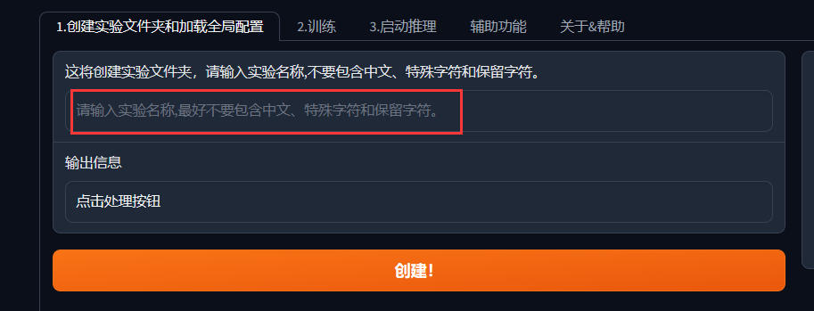

## 上传待训练的音频数据到

`/app/Data/实验名/custom_character_voice`
音频按说话人单独放在一个文件夹

演示以/app/peila这个音频为例

## 加载全局配置
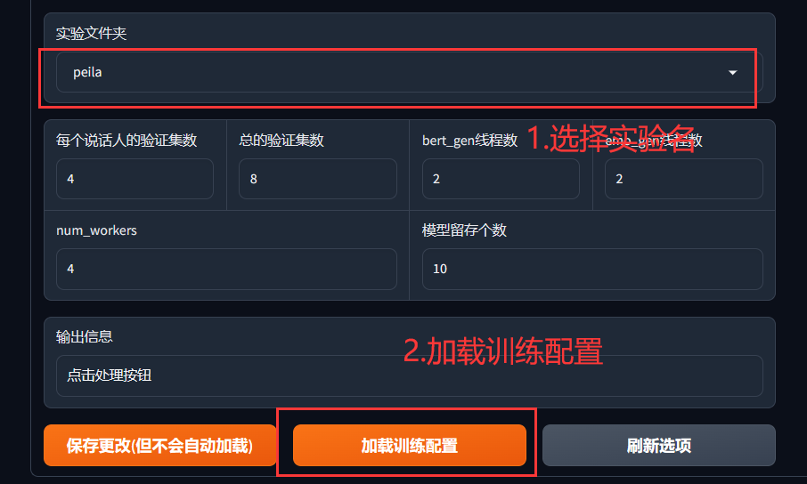

# 音频数据标注
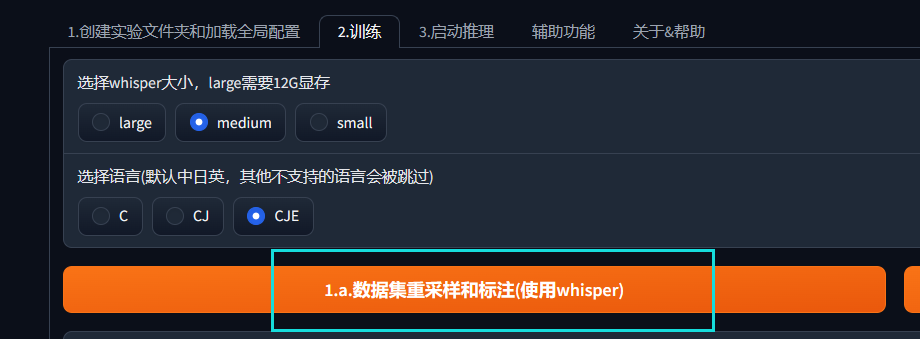
命令行输出
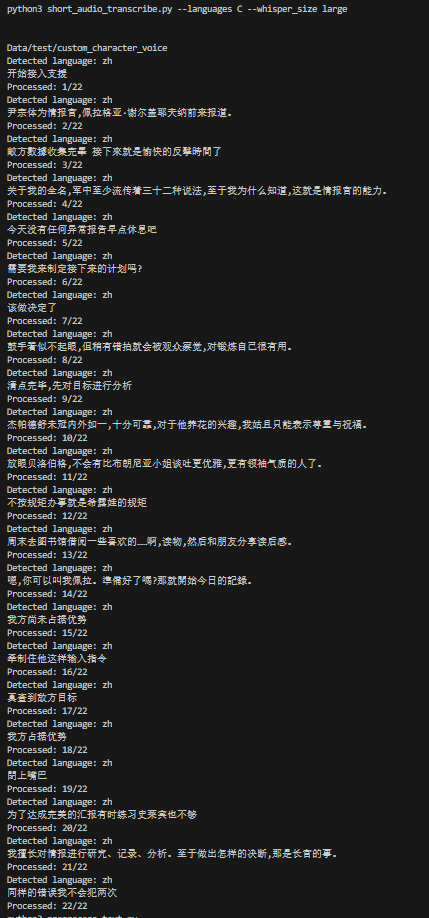
ds
# 文本预处理
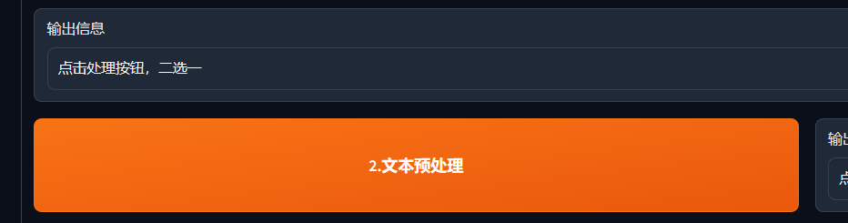
命令行输出
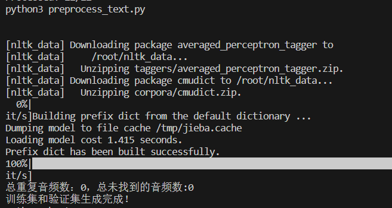

# 生成bert文件

命令行输出
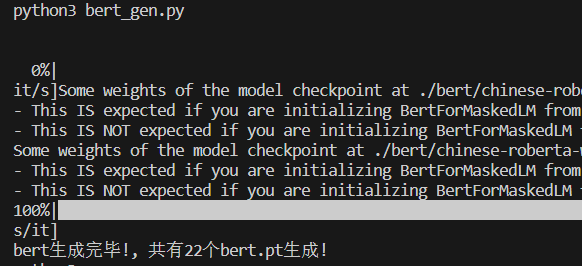

# 生成emo文件

命令行输出
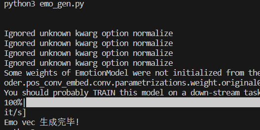

# 写入配置文件
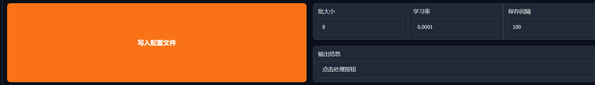

# 首次训练

命令行输出
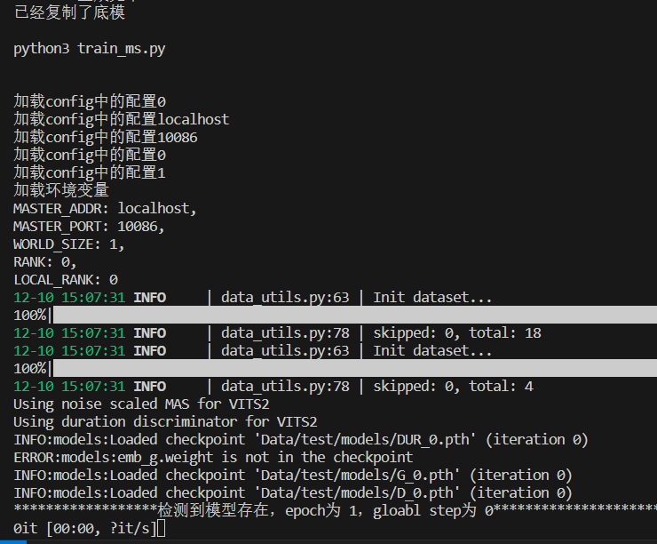

# 启动tensorboard

命令行输出
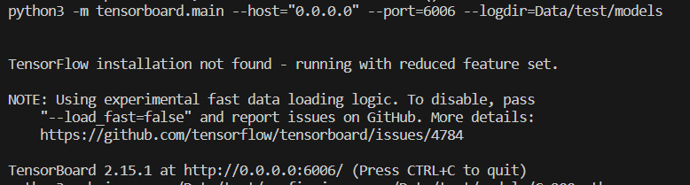

# 启动推理
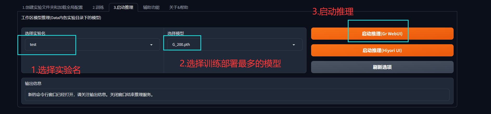
命令行输出
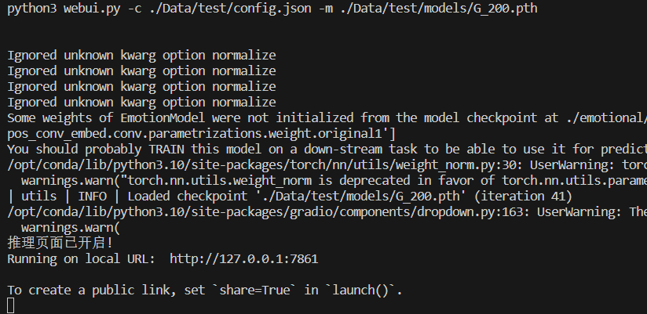

