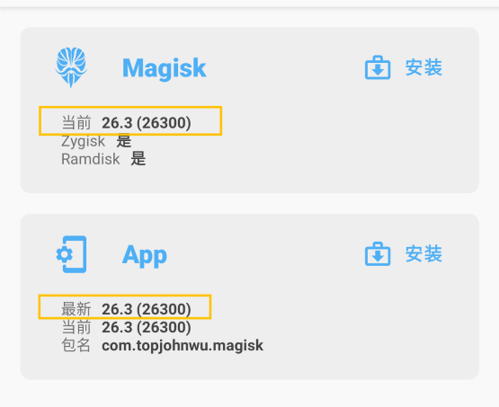
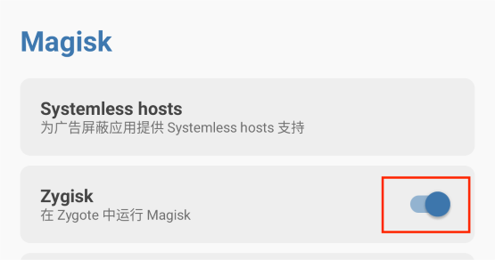
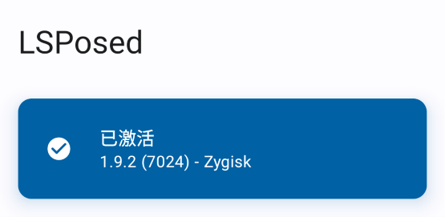
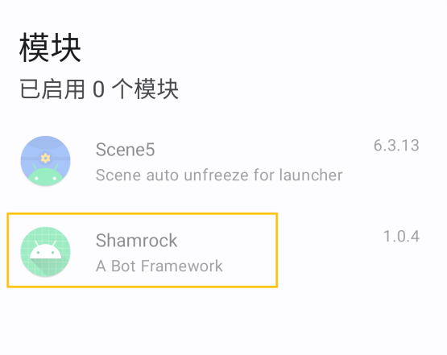
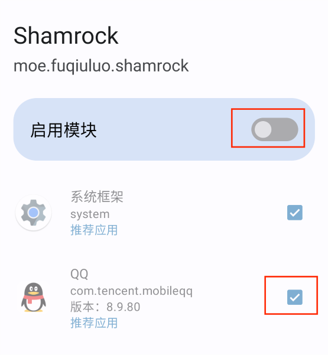
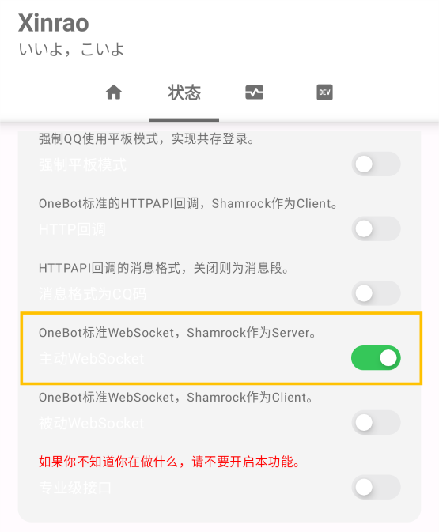
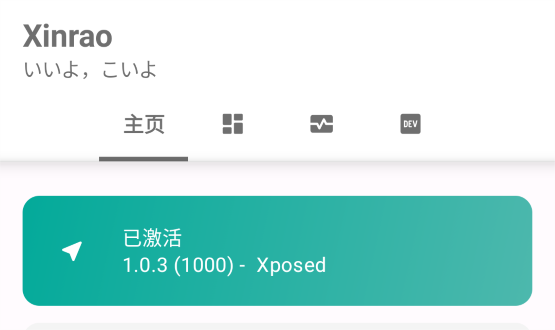
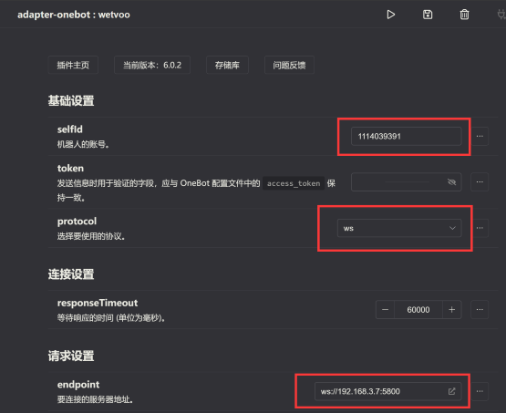

[Shamrock](https://github.com/linxinrao/Shamrock) 是一个基于 Xposed 实现 OneBot 标准的 QQ 机器人框架

- 需要 Magisk 环境
- 基于安卓 QQ
- 运行内存大于 700M（其中 LSPosed 100M; Shamroak 300M; QQ 300M）
- 支持持久化 QQ 登录状态和数据

# 目录

- 1. 准备工作
- 2. 安装软件
- 3. 配置 Shamrock
- 4. 启用 QQ
- 5. 接入 Koishi

# 正文

## 1. 准备工作

### 1.1 准备 Magisk

准备一台拥有 Magisk 环境的手机 将 Magisk 的版本更新到 26.3

### 1.2 准备 QQ

将 QQ 更新到 8.9.80 以上版本

## 2. 安装软件

### 2.1 [安装 LSPosed 模块](https://magiskcn.com/lsposed-install)

在 Magisk 的设置中开启 LSPosed, 重启手机

LSPosed 安装成功后的界面是这样的:

### 2.2 安装 Shamrock

去[Github release](https://github.com/linxinrao/Shamrock/releases) 或 [Github Action](https://github.com/linxinrao/Shamrock/actions?query=event%3Apush) 中下载安装包，然后安装

## 3. 配置 Shamrock

### 3.1 打开 LSPosed（在通知栏）的模块

### 3.2 打开模块中的 Shamrock, 勾选 QQ, 并启用模块

### 3.3 打开软件 Shamrock 的【状态】开启【OneBot 标准 WebSocket，Shamrock 作为 Server。】

### 3.4 重启 QQ 或 重启手机后打开 QQ（推荐）

Shamrock 配置成功后的界面:

## 4. 接入 Koishi

### 4.1 安装 onebot 适配器

### 4.2 配置 onebot 适配器

- selfId 输入你的机器人 QQ 账号
- protocol 选择 ws
- endpoint 输入 `ws://<Shamrock 所在手机的 IP>:5800`
  - 若你的 Koishi 和 Shamrock 部署在同一台手机上， endpoint 输入` ws://127.0.0.1:5800` 即可

