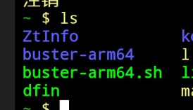
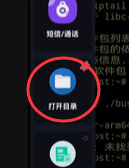
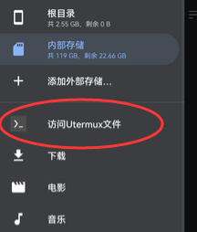

ZeroTermux 是基于 termux 二次开发的，Android 终端应用程序和 Linux 环境。
相较于 Termux, ZeroTermux 集成了很多实用的功能如备份恢复，容器切换，文件管理器等实用的功能，对新手非常友好

下文中的 Termux 均指代 ZeroTermux

由于 Termux 与 Linux，有许多[不同之处](https://wiki.termux.com/wiki/Differences_from_Linux),
存在许多限制，因此我们在在使用 Termux 时一般通过使用 PRoot 设置 Linux 发行版 rootfs 来绕过这些限制。

# 准备工作

更换镜像源，点击音量上键，点击`切换源`，切换为`清华源`或者`北京源`

遇到 yes/no 全选 y

注意，该方法只适用于 termux 会话中， 若你的会话处于 proot 容器内，请先停止当前任务，输入`exit`退出 proot 容器

# 如何区分会话是否处于 proot 容器内？

- 方法 1
  查看终端的提示符

当终端的提示符为“#”时，您的会话正处于 proot 容器

如果提示符是“$”，您的会话不在 proot 容器

- 方法 2
  查看用户

如果用户显示的是 root，您的会话正处于 proot 容器

如果没有显示用户，您的会话不在 proot 容器

# 如何进入 proot 容器？

- 1. 如果你是用 tmoe 安装的 proot 容器，那么你应该用 tmoe 来进入 proot 容器，输入命令 tmoe，打开 tmoe 菜单，根据提示启动

- 2. 如果你是使用左侧`发行版本`选项安装的 proot 容器，那么在初始的目录下会生产一个启动脚本， 脚本通常以 arm64.sh 结尾

  可以输入`ls`命令查看
  

  启动示例 `bash buster-arm64.sh` 或者 `./buster-arm64.sh`

# 如何备份容器？

注意，该方法只适用于 termux 会话中， 若你的会话处于 proot 容器内，请先停止当前任务，输入`exit`退出 proot 容器

音量上键 选择 `备份/恢复`，在弹出的对话框中选择`tar.gz`

等待备份完成后，你将在你的手机的 `/sdcard/xinhao/data` 目录看到生成的恢复包，

你可以将此恢复包发送给你的朋友们

# 如何恢复容器？

注意，该方法只适用于 termux 会话中， 若你的会话处于 proot 容器内，请先停止当前任务，输入`exit`退出 proot 容器

恢复前请先确保 你的恢复包处于 `/sdcard/xinhao/data` 目录

和备份操作一样，进入对话框，点击恢复项，选择一个恢复包，输入新的容器名称即可开始恢复

建议容器起名清晰明了，，否则容器多了你会分不清的；
不用的容器即使删除，释放手机存储空间

# 如何使用文件管理器修改容器文件？

ZeroTermux 集成了强大的文件管理器，你可以通过该插件来修改容器内的文件

音量上键呼出菜单栏，拉到下面，找到打开目录，你会安装一个插件

打开该插件，右侧菜单， 访问 Utermux 文件

# [如何安装 proot 容器](./install_debian.md)
